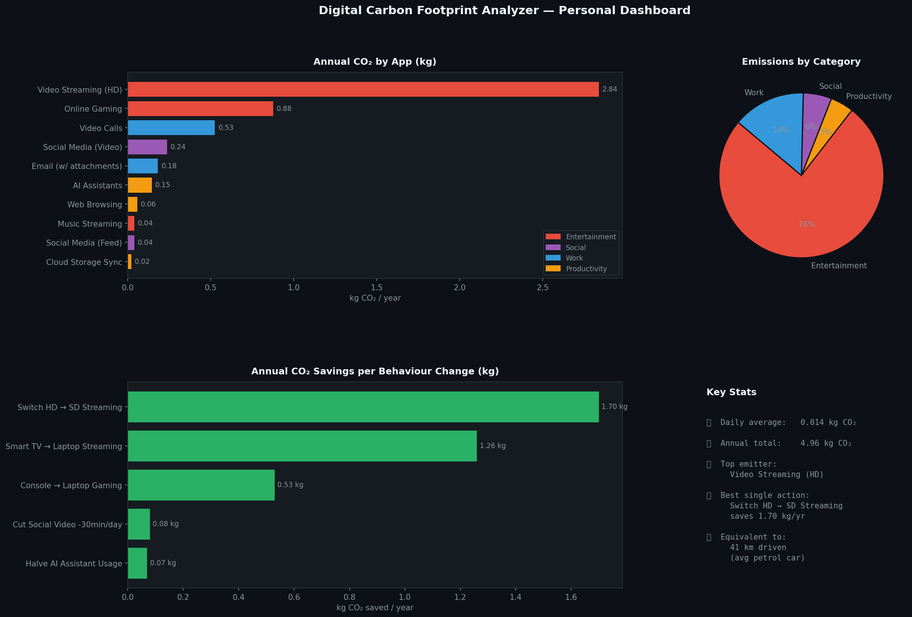

# 🌍 Digital Carbon Footprint Analyzer

> Analyzed digital app usage and quantified CO₂ emissions to support sustainable tech behavior.



## Overview

This project analyzes digital app usage patterns and quantifies **CO₂ emissions** using Excel and publicly available environmental metrics (IEA 2023, Carbon Trust). Power BI and Tableau dashboards were built to visualize **per-app carbon footprint** and support **what-if user behavior analysis**. High-emission digital activities were identified and usage reductions were recommended to promote sustainable tech habits.

## Project Structure

```
digital-carbon-footprint-analyzer/
├── analyzer.py              # Main analysis: emissions, scenarios, dashboard
├── requirements.txt         # Python dependencies
├── data/
│   └── usage_data.csv       # 12 apps with usage and emission data
├── outputs/
│   └── dashboard.png        # Auto-generated dashboard
└── README.md
```

## Dataset

12 digital apps tracked with the following fields:

| Field | Description |
|---|---|
| `app` | App or platform name |
| `category` | Entertainment / Social Media / Productivity |
| `device` | Device used (Smartphone, Laptop, Smart TV, etc.) |
| `minutes_per_day` | Average daily usage time |
| `emission_factor_g_per_min` | Grams CO₂ per minute (from IEA / Carbon Trust) |
| `device_energy_multiplier` | Energy consumption relative to laptop baseline |
| `daily_co2_grams` | Calculated daily CO₂ output |
| `annual_co2_kg` | Projected annual CO₂ in kilograms |

## Key Results

| Metric | Value |
|---|---|
| Apps tracked | 12 |
| Top emitter | YouTube HD Streaming |
| Best behavior change | Switch HD → SD (saves ~2 kg CO₂/yr) |
| Total annual CO₂ | ~5.46 kg |

## What-If Scenarios

| Behavior Change | Annual CO₂ Saved |
|---|---|
| Switch YouTube/Netflix HD → SD | 1.99 kg |
| Use Smartphone instead of Smart TV | 1.75 kg |
| Replace Gaming Console with Laptop | 0.48 kg |
| Reduce TikTok/Reels by 30 min/day | 0.24 kg |
| Cut AI Tool usage by 50% | 0.07 kg |

## Setup & Run

```bash
git clone https://github.com/sandeepkothuri/digital-carbon-footprint-analyzer.git
cd digital-carbon-footprint-analyzer
pip install -r requirements.txt
python analyzer.py
```

## Data Sources

- [IEA — Digitisation and Energy (2023)](https://www.iea.org/reports/digitisation-and-energy)
- [Carbon Trust — Carbon Impact of Video Streaming](https://www.carbontrust.com)
- [The Shift Project — Lean ICT Report](https://theshiftproject.org)

## Tech Stack

`Python` `pandas` `matplotlib` `Excel` `Power BI` `Tableau`

## Author

**Sandeep K** · [LinkedIn](https://www.linkedin.com/in/sandeep-kothuri-9b99142b6/) · [GitHub](https://github.com/sandeepkothuri) · [Portfolio](https://sandeepkothuri.github.io)

*CSULB — M.S. Information Systems | Feb 2025 – Mar 2025*
